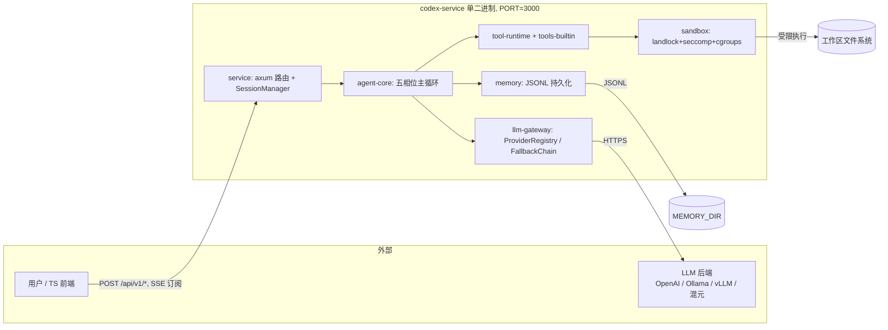
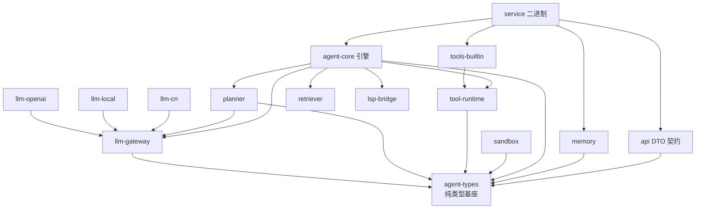
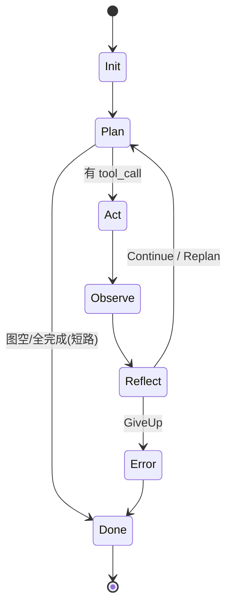
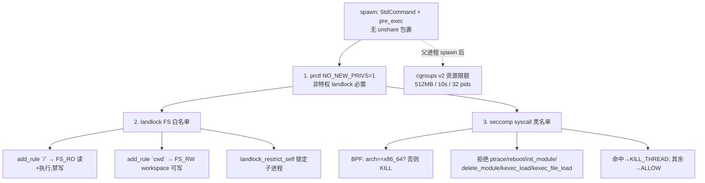

# Codex-Rust 顶层设计文档

> **版本**：v1.2 基线（2026-07-28）　**定位**：团队架构基线 + 新人 onboarding　**性质**：唯一顶层设计文档（as-built 现状 §1–12 + 缺口登记 §13 + To-Be 路线图 §14）
>
> **溯源约定**：本文档全部论断均标注 `文件:行号`，可在仓库中直接复核。不写无源码依据的内容。

---

## 0. 文档说明

**一句话**：本文档是 codex-rust 的唯一架构基线——读它即可建立对系统的完整心智模型，无需先读代码。

**目的与受众**：
- 新成员 onboarding：不看代码也能理解系统边界、主循环、安全模型与契约。
- 团队基线：后续迭代的架构裁决以本文档为准；改动架构时同步更新本文档。

**与既有 21 份文档的关系**：仓库根目录与 `docs/` 下的审计报告（`audit-report.md`、`v1.1-*`、`global-audit-report.md`、`gatekeeper-audit-*`）、阶段报告（`docs/pN-phase-report.md`）、交接说明（`handoff-sandbox-fix.md`）均为**事后报告**（"做了什么/发现了什么"），不是设计文档。本文档是**事前/事中设计基线**（"系统是什么、为什么、要去哪"）。两份曾在上游存在的事前文档——`architecture.final.md` 与 `execution-plan.md`——**未随仓库交付，永久缺失**（`crates/api/src/lib.rs:8` 注释已将契约兜底改为"本 enum 即契约"）。全仓无 README，本文档同时承担入口职责。

**阅读路径**：图省时间看 §1 上下文 + §2 主循环 + §13 缺口；做开发按章节按需深入；评审架构看 §4 安全模型 + §10 安全部署 + §14 路线图。

---

## 1. 系统总览与上下文

**一句话**：codex-rust 是一个**单进程、单二进制**的自主编码 Agent 服务——前端/用户经 HTTP+SSE 驱动它，它循环调用 LLM 与本地工具完成任务。

### 1.1 系统上下文



- **北向**：`/api/v1/*` REST + SSE（见 §7），CORS 默认 `http://localhost:5173`（`service/src/main.rs:173`）。
- **南向**：LLM 后端经 `reqwest` HTTPS（`Cargo.toml:35`）；工具经 sandbox 落子进程（见 §4）。
- **持久化**：会话事件写 `MEMORY_DIR`（默认 `./memory`，`main.rs:138`）。
- **部署拓扑**：单进程。会话状态在进程内 `HashMap`（`service/src/session.rs:41`），**不支持多实例水平扩展**（重启后仅从 JSONL 恢复记录，运行时状态丢失）。

### 1.2 Crate 分层与依赖方向



- **`agent-types` 是唯一基座**：`TaskGraph`/`Message`/`ToolCall`/`Budget` 等共享类型，被所有 crate 依赖（`crates/agent-types/src/lib.rs`）。
- **依赖倒置**：`agent-core` 不依赖具体 provider/工具/sandbox，全部经 `Arc<dyn Trait>` 注入（`LlmProvider`、`Planner`、`ToolDispatcher`、`Sandbox`）。
- **17 个 crate**（`Cargo.toml:3-21`），`rust-version = 1.82`（`Cargo.toml:26`），P2 外部依赖 `tree-sitter 0.24` / `tantivy 0.22`（`Cargo.toml:60-63`）。
- **唯二可执行入口**：`service`（axum，`main.rs:17`）；测试入口见 §11。

---

## 2. Agent 主循环（核心引擎）

**一句话**：`AgentLoop::run()` 是一个 `loop{}` 驱动的**五相位状态机** `Init→Plan→Act→Observe→Reflect`，由 `planner.reflect` 的三态裁决决定继续/重规划/放弃，预算耗尽或异常兜底终止。

### 2.1 相位状态机



源码：`agent-core/src/loop.rs`——`run()` @958、`step()` @937、`do_plan()` @477、`do_act()` @614、`do_observe()` @680、`do_reflect()` @831。

### 2.2 各相位职责与 SSE 发射点

| 相位 | 职责 | 发射事件（映射到 §7 契约） |
|---|---|---|
| Init | 重置计数器、初始化 | `Phase(Init)` |
| Plan | LLM 产出文本 + tool_call；注入 TaskGraph/检索/LSP 上下文 | `Phase`、`Token`、`ToolCall` |
| Act | 调度执行工具；**危险操作先走审批阻塞门** | `Phase`、`ToolResult`（审批时 `NeedApproval`） |
| Observe | 收集工具结果 + LSP 诊断 + 检索 + 子代理结果 | `Phase`、`LspDiagnostics`、`Retrieval` |
| Reflect | 构造 `Observation`，交 `planner.reflect` 裁决 | `Phase`、`Reflection` |

事件枚举定义于 `agent-core/src/loop.rs:33-47`，由 `service/src/session.rs:527-559` 映射为 API `AgentEvent`。

### 2.3 三态裁决与终止条件矩阵

`do_reflect` 调 `planner.reflect(obs, state)` 得 `ReflectVerdict`（`agent-types/src/lib.rs:86-93`）：

| 裁决 | 行为 | 源码 |
|---|---|---|
| Continue | 回 Plan 继续 | `loop.rs` do_reflect |
| Replan | `replan_count += 1`、重置 `steps_without_progress`、失败节点重置 Pending，回 Plan | `loop.rs:894-904` |
| GiveUp | 走 Error → Done | `loop.rs` do_reflect |

**终止条件矩阵**（任一命中即出循环）：
1. `planner.reflect` 判 `GiveUp`（三路：连续错误≥3 / 预算=0 / 预算≤15% 且无进展≥2，见 §3.2）。
2. `budget_exhausted`（`max_steps` 硬顶）→ `Done(ok=false)`，`loop.rs:976`。
3. 正常 `Done`（Plan 短路或全部完成）。
4. 异常/panic → `session.rs` 捕获补发 `Error`+`Done`（`session.rs:392-409`）。

> ⚠️ **关键机制**：`do_reflect` 的 Replan 分支**故意不重置 `consecutive_errors`**（`loop.rs:901-904`）——让"连续错误"跨 replan 周期累积，靠 `consecutive_errors>=3→GiveUp` 兜底防死循环。这是 A3 缺口的核心（见 §3.3、§13）。

### 2.4 审批阻塞门（前端"审批交互"能跑通的依据）

`do_act` 执行前调 `tool_call_needs_approval` 判定（bash 破坏性命令 / edit 越界写，`loop.rs` APPR-1 注释 @49-58）。命中则 `emit NeedApproval` 并 `check_approval()` **真正阻塞**等待前端 `POST /approvals`；拒绝则把结果标 `user denied` 直接跳 Reflect（`loop.rs:627-661`）。审批状态按 `session_id` 隔离（M2，`tool-runtime/src/dispatcher.rs`）。

---

## 3. 规划与子代理（P3）

**一句话**：`DefaultPlanner` 用一次 LLM 调用把 goal 拆成 `TaskGraph`（DAG），再用启发式阈值 + LLM 慢路径做反省裁决；子代理有深度守卫，但**结果无内容级合并**。

### 3.1 decompose：任务拆解

`planner/src/lib.rs:43-153`：单次 LLM 调用（temperature 0.2、max_tokens 2048），要求输出 JSON 数组（`id/description/deps/delegable`）。容错：截取首个 `[` 到末个 `]`（@97-105），解析失败降级为单节点 execute 计划（@131-141）；**不强制去环**，仅记录 `is_acyclic`（@146-150）。R1：注入 retrieval_context 与 lsp_diagnostics 进 prompt（@58-74）。

`TaskGraph`/`TaskNode`/`PlanState` 是纯类型（`agent-types/src/lib.rs:6-82`）：节点含 `deps`（前驱）、`delegable`（可否派生子代理）、`status`；`PlanState` 含 `replan_count`/`total_steps`。纯函数 `is_acyclic`/`topo_order` 在 @204 起——**但主循环并不按拓扑真实调度，TaskGraph 只作为"建议性上下文"注入 system prompt**（见 §13）。

### 3.2 reflect：反省阈值表

`planner/src/lib.rs:155-265`，常量 @27-29：`MAX_CONSECUTIVE_ERRORS=3`、`MAX_STEPS_WITHOUT_PROGRESS=5`、`BUDGET_LOW_THRESHOLD=0.15`。判定按序短路：

| 序 | 条件 | 裁决 | 行号 |
|---|---|---|---|
| 1 | `consecutive_errors >= 3` | GiveUp | @159-166 |
| 2 | `budget_remaining == 0` | GiveUp | @169-172 |
| 3 | 预算≤15% 且 `steps_without_progress >= 2` | GiveUp | @174-183 |
| 4 | `steps_without_progress >= 5` | **Replan（★ 无 replan_count 上限）** | @186-193 |
| 5 | `consecutive_errors >= 2` 且 `replan_count < 3` | Replan（★ 唯一 replan_count 判断） | @196-203 |
| 6 | 以上都不中 → LLM 慢路径（temp 0.1，子串匹配 give_up/replan/continue） | 三态 | @205-264 |

### 3.3 A3 裁决结论：replan 严格意义的硬封顶不存在

这是此前"loop.rs 注释 vs 审计报告"矛盾的定论（双方各对一半）：

- `loop.rs:507` 注释称"planner 用 `replan_count < 3` 封顶"——**仅对 planner/lib.rs:196 的"连续错误≥2"分支成立**。
- **第 4 路**（`steps_without_progress>=5`，@186）与**第 6 路 LLM 慢路径**（@205-264）产出的 Replan **均无 `replan_count` 上限**。
- 实际防死循环是**间接**的：连续出错时 `consecutive_errors` 不被 replan 重置（`loop.rs:901-904`），3 次后由第 1 路 GiveUp 兜底；但"**无进展但无错误**"场景下 `steps_without_progress` 每次 replan 清零，理论上可无限 Replan，最终只受 `max_steps` 预算硬顶（`loop.rs:976`）约束。

> 外部规格 "P3 spec §5 禁止无界 replan"（`loop.rs:903` 引用）**未随仓库交付**，代码注释与实现存在落差——见 §13 缺口登记。

### 3.4 子代理

`loop.rs:305-402`：`spawn_sub_agent` @308——`depth>=1` 禁止再派生（SBOX-3，@315-325），子深度强制 `max(调用值, 父+1)`（@328）；子代理经 `tokio::spawn` 独立跑完整 `AgentLoop`，不发事件到父流（@348）；结果以 `RunReport.summary` 按 `task_id` 回写父节点（@349-359）。

> ⚠️ **A4 缺陷（已坐实）**：`collect_sub_agent_results`（@376）只把子代理结果折算成节点 `status` + 一行文本 `result`，**无任何内容级 merge / diff / 冲突处理**；子代理对文件系统的改动靠共享 `cwd` 天然"合并"。

---

## 4. 工具与沙箱安全模型

**一句话**：5 个内建工具经 `ToolDispatcher` 执行，shell 类命令在 Linux 下由 **landlock（FS 白名单）+ seccomp（syscall 黑名单）+ cgroups v2（资源限额）** 在 `pre_exec` 中隔离——**不用 `unshare` 包裹**，因此非特权用户可用。

### 4.1 工具集与路径防护

`main.rs:120-124` 注册：`BashTool / ReadTool / EditTool / GlobTool / GrepTool`。M1：read/edit/grep 拒绝绝对路径与 `..` 穿越（`tools-builtin/src/edit.rs:46`、`read.rs:42`、`grep.rs:69`）。M7：glob/grep 也纳入 sandbox 管辖（`glob.rs:60`、`grep.rs:93`）。

### 4.2 pre_exec 隔离栈（核心）



源码 `sandbox/src/lib.rs`：
- **`spawn` @538**：用 `StdCommand` + `child.pre_exec(sandbox_pre_exec)`（@596-599）。**刻意不包 `unshare --mount/--pid`**——那需要 `CAP_SYS_ADMIN` 或非特权 user namespace（许多加固内核禁用，会 EPERM），而 landlock+seccomp 只需 `NO_NEW_PRIVS`（@550-558）。
- **`sandbox_pre_exec` @239-258**：先 `prctl(PR_SET_NO_NEW_PRIVS,1)`（@245，非特权 landlock 的硬前提），再 `apply_landlock_in_child`（@252），再 `apply_seccomp_deny_list`（@255）。

### 4.3 landlock 实际挂载点（路径规则）

**landlock 的"挂载点"不是 mount namespace，而是两条路径规则**（`lib.rs:308-316`，经 `landlock_add_rule(RULE_PATH_BENEATH)` 落 `parent_fd`，最后 `restrict_self` @319 锁定）：

| 路径 | 权限 | 来源 |
|---|---|---|
| `/` | `FS_RO`（read_file+read_dir+execute，**禁写**） | `read_only_paths` 默认 `["/"]`（@71） |
| `<cwd>`（workspace） | `FS_RW`（读写+执行） | `writable_paths` 默认 `[current_dir()]`（@73） |

> 设计权衡（`lib.rs:62-70`）：landlock 默认拒绝一切未授权 FS 访问，但要跑命令必须能遍历+执行系统二进制与动态链接器，故给整树 READ+EXECUTE；写权限只放 workspace。**类比 `firejail --ro-root`**。
>
> ⚠️ 注释/实现不一致（§13）：@206 注释称 workspace "no execute"，但 `FS_RW = FS_RO | 写类标志`（@207-219）而 `FS_RO` 含 `EXECUTE`——**workspace 实际也有执行权**。

### 4.4 seccomp 实际挂载点（线程级 BPF 过滤器）

**seccomp 的"挂载点"是经 `prctl(PR_SET_SECCOMP, SECCOMP_MODE_FILTER)` 装到线程的 BPF 黑名单**（`lib.rs:343-435`）：校验 `arch==x86_64`（否则 KILL，@373-388）；命中 6 个危险 syscall 即 `SECCOMP_RET_KILL_THREAD`，其余 `ALLOW`（@397-416）。拒绝清单（@355-365）：`ptrace(101) / reboot(169) / init_module(175) / delete_module(176) / kexec_load(246) / kexec_file_load(320)`。`mount/umount2` **未禁**（@354 注释：历史兼容，现已不用 unshare）。

### 4.5 cgroups v2 资源限额（父进程侧）

`apply_cgroups_impl` @473-517：需 `/sys/fs/cgroup/cgroup.controllers` 存在（@479）；建 `codex-sandbox-<pid>` 并写 `memory.max=512MB`、`cpu.max=10000/100000`（≈10s）、`pids.max=32`（@500-514）；命令结束 `cleanup_cgroup` 移除目录（@520-524）。X1：超时路径会 SIGKILL 子进程并清 cgroup，防泄漏（@629-645）。

### 4.6 非 Linux 回退

`create_sandbox` @83-99：`#[cfg(linux)]→LinuxSandbox`，否则 `NoopSandbox`（@103）并打印 **"no real isolation — Do NOT use in production"**（@96）。Noop 只做 best-effort 提示，无真实隔离。

---

## 5. LLM 接入层（P4/P5）

**一句话**：`llm-gateway` 用 `ProviderRegistry` 统一抽象四家后端，`FallbackChain` 提供可选降级链，`CostMeter` 做会话级真实 token 记账。

- **抽象**：`LlmProvider` trait（`llm-gateway/src/provider.rs:11`）、`ChatRequest`/`ChatResponse`/`Usage`（`types.rs:7/17/42`）。
- **注册**：`ProviderRegistry`（`registry.rs:10`）。`main.rs` 按 env 注册四家：OpenAI（永远注册，模型 `gpt-4o` 硬编码 @41）、Ollama（`OLLAMA_BASE_URL` 开关 @48）、vLLM（@62）、混元（@78）。
- **降级链**：`FallbackChain`（`fallback.rs:25`），`FALLBACK_CHAIN=1` 时把全部已注册 provider 包成 `"fallback"` provider（`main.rs:93-114`）。
- **记账**：`CostMeter`（`cost.rs:32`）。P5 起 usage 来自 `RunReport` 真实累计，不再伪记（`loop.rs:573`、`session.rs:340-361`）。

---

## 6. 智能增强层（P2 / A4 / A5）

**一句话**：语义检索（retriever）与 LSP 诊断（lsp-bridge）已实现，但**生产默认未接线**——这是"实现了但没启用"的最大落差。

- **retriever（A5）**：BM25 + 向量 RRF 融合，`embed provider` 接入（`retriever/src/lib.rs:92-479`）。
- **lsp-bridge（A4）**：LSP 诊断作为硬信号注入 observe/plan（`lsp-bridge` crate）。
- **接线机制**：`SessionManager.set_retriever / set_lsp_bridge`（`session.rs:74-81`），注入每个 `AgentLoop`（@129-135）。
- **现状**：`main.rs` **从未调用这两个 setter**——retriever 走 `None`、lsp 走 `NoopLspBridge`，即 **生产二进制默认关闭**。代码与单测里都已实现，仅缺 main.rs 两行接线（见 §13/§14）。

---

## 7. 北向 API 契约

**一句话**：6 个 REST/SSE 端点 + 8 类 SSE 事件，契约就是 `api` crate 的 serde 类型；前端只需持 `session_id`。

### 7.1 端点表

| 方法/路径 | 作用 | 处理 |
|---|---|---|
| POST `/api/v1/sessions` | 创建会话 | `routes::create_session` |
| GET `/api/v1/sessions/{id}` | 查状态（phase/steps/budget） | `routes::get_session_status` |
| POST `/api/v1/sessions/{id}/messages` | 发消息 → **返回 SSE 流** | `routes::send_message` |
| POST `/api/v1/sessions/{id}/approvals` | 提交审批 | `routes::submit_approval` |
| POST `/api/v1/sessions/{id}/cancel` | 取消 | `routes::cancel_session` |
| GET `/api/v1/models` | 列 provider | `routes::list_models` |

路由：`main.rs:187-193`。**无历史回放端点**（无 GET messages，见 §13）。

### 7.2 SSE 事件契约（8 类）

`AgentEvent`（`api/src/lib.rs:11-41`，`#[serde(tag="type")]`）：`Phase / Token / ToolCall / ToolResult / NeedApproval / Reflection / Done / Error`。

**前端必须知道的两点**：
1. **类型通道分裂**：REST JSON 里 `AgentEvent` 带 `type` 字段；但 SSE 推送时 `sse.rs:12-39` **手动剥离 `type`、写进 SSE 的 `event:` 行**（`sse.rs:43-52`）。前端解析 SSE 要读 `event:` 名，不是 payload 里的 `type`。
2. **POST 返回 SSE**，浏览器 `EventSource` 只支持 GET——**前端须用 `fetch()` + `ReadableStream` 读流**，不能直接用 `EventSource`。

keep-alive 15s（`sse.rs:81-85`）；序列化/滞后失败记 warn 不静默吞（SSE-1，`sse.rs:65-78`）。契约锚点：`api/src/lib.rs:8` 注释"本 enum 即契约"（原 `architecture.final.md §15.3` 未交付）。

---

## 8. 配置管理

**一句话**：全部配置走环境变量（16 个，集中于 `main.rs`）+ `.env`（dotenvy @28）；少数项硬编码。

| 变量 | 默认 | 作用 | 行号 |
|---|---|---|---|
| OPENAI_API_KEY | `sk-placeholder`(warn) | OpenAI 密钥（主 provider） | @34-37 |
| OPENAI_BASE_URL | 无 | OpenAI 自定义端点 | @38 |
| OLLAMA_BASE_URL | 未设=跳过 | Ollama 注册开关 | @48 |
| OLLAMA_MODEL | `llama3.2` | Ollama 模型 | @49 |
| VLLM_BASE_URL | 未设=跳过 | vLLM 注册开关 | @62 |
| VLLM_MODEL | `mistral-7b` | vLLM 模型 | @63 |
| VLLM_API_KEY | 无 | vLLM 鉴权 | @64 |
| HUNYUAN_API_KEY | 未设=跳过 | 混元注册开关 | @78 |
| HUNYUAN_MODEL | `hunyuan-pro` | 混元模型 | @79 |
| HUNYUAN_BASE_URL | 无 | 混元端点 | @80 |
| FALLBACK_CHAIN | 关 | `=1/true` 启用降级链 | @94 |
| MEMORY_DIR | `./memory` | JSONL 持久化目录 | @138 |
| API_KEY | 未设=**API 开放**(warn) | Bearer 鉴权 | @153 |
| CORS_ORIGIN | `http://localhost:5173` | CORS 允许源（单值） | @169-173 |
| PORT | `3000` | 监听端口 | @206 |
| RUST_LOG | `info` | tracing 过滤 | @21-24 |

**硬编码清单**（不可 env 覆盖）：OpenAI 模型名 `gpt-4o`（@41）、body 上限 2MB（@201）、OOM-1 TTL 3600s / sweep 300s（@148-149）。

---

## 9. 数据模型与持久化

**一句话**：会话以 **JSONL（meta 行 + event 行）** 落盘到 `MEMORY_DIR`，经 v1.2 MEM-1~5 加固。

- **schema**：`SessionRecord{session_id, provider_name, model, goal, events, created_at}`（`memory/src/lib.rs:13-20`）、`StoredEvent{seq, event_type, payload, timestamp}`（@24-29）。`MemoryStore` trait 6 方法（@33-51）。
- **布局**：每会话一文件 `<MEMORY_DIR>/<session_id>.jsonl`（@86-88）；第 1 行 `{"type":"session_meta",...}`（@109-117），后续每行 `{"type":"event",...}`（@121-129）。`save_session` 全量重写、`append_events` 增量追加，共用写锁。
- **MEM-1~5 加固**（@58-74）：tmp+rename 原子写（@101/146）、tokio::Mutex 串行写（@95）、单文件 64MiB 上限（@74/135-144）、load 坏行 warn+skip（@164-176）、session_meta 缺字段告警（@179-187）。
- **session 状态机**：`created→running→done/error/cancelled`（`session.rs`），`finished_at` 供 OOM-1 TTL 驱逐。

---

## 10. 安全与部署

**一句话**：默认**开发态开放**（无鉴权），生产必须设 `API_KEY`；威胁模型以 sandbox 为核心信任边界。

### 10.1 信任边界

```mermaid
flowchart LR
    U[不受信: 用户输入/前端] -->|Bearer(可空)| API[API 层<br/>AUTH-0 + CORS + 2MB]
    API --> CORE[Agent 核心]
    CORE -->|LLM prompt| EXT1[外部: LLM 后端]
    CORE --> TOOL[工具]
    TOOL --> SBX[sandbox 边界<br/>landlock+seccomp+cgroups]
    SBX --> EXT2[受控: 工作区 FS]
```

### 10.2 已落地控制（as-built）

| 控制 | 机制 | 行号 |
|---|---|---|
| 认证 | AUTH-0 可选 Bearer，常量时间比较；**未设 API_KEY 则全开并启动告警** | `main.rs:152-161`、`routes.rs:16-58` |
| CORS | 单源白名单 + 方法/头白名单（API-3） | `main.rs:166-184` |
| body 上限 | 2MB（API-1 显式） | `main.rs:199-201` |
| 命令隔离 | landlock+seccomp+cgroups（§4） | sandbox |
| 危险操作 | 审批阻塞门（§2.4） | loop.rs APPR-1 |
| 路径防护 | M1 拒绝穿越 | tools-builtin |
| 资源/OOM | OOM-1 会话 TTL 驱逐 | `main.rs:147-150`、`session.rs:473-514` |

### 10.3 威胁模型（正式化自 `security-audit-v1.1-final.md` 攻击面矩阵）

- **命令注入/越权写** → sandbox landlock（workspace 外禁写）+ M1。
- **危险 syscall**（ptrace/reboot/加载模块）→ seccomp 黑名单。
- **资源耗尽**（fork 炸弹/内存）→ cgroups pids/memory 上限 + OOM-1 TTL。
- **未授权 API 访问** → API_KEY（但默认空=开放，**生产首要风险**）。
- **prompt 注入经工具结果回流** → 现状无专门防御（见 §13）。

---

## 11. 可观测性与质量保障

**一句话**：日志靠 `tracing`；测试体系完整但**无 CI**；`telemetry`（eval harness）当前是**孤儿代码**。

- **日志**：`tracing_subscriber` + `EnvFilter`（`main.rs:20-25`），关键路径有 info/warn。
- **测试**：单测内嵌各 crate（`#[cfg(test)]`）；**唯一集成测试** `service/tests/integration_test.rs`（约 1600 行，覆盖 SSE/多后端/FallbackChain/工具/持久化/记账，mock 走本地 hyper + ScriptedProvider，无真实外网）。
- **CI**：**无** `.github/`、无任何 CI 配置——验收靠手动 `cargo test` + 人工审计文档。
- **telemetry**：实为 eval harness（`telemetry/src/eval.rs`），但全仓 0 调用、未接 CI（ORPHAN-1），名不副实（见 §13）。

---

## 12. 演进史与标签图例（罗塞塔表）

**一句话**：代码注释里的 `P/A/M/X/MEM/...` 标签是理解演进脉络的钥匙，下表是解码表。

| 族 | 含义 | 代表 |
|---|---|---|
| P0–P5 | 阶段：骨架→工具沙箱→智能(P2)→规划(P3)→多后端(P4)→工程化(P5) | 各 `pN-phase-report.md` |
| A1–A5 | 各阶段内"验收用例"编号（含义随阶段变） | planner A1/A2、loop A3/A4/A5、sandbox A1 |
| M1/M2/M4/M7 | v1.1 安全/隔离修复 | 路径防护、审批会话隔离、取消、sandbox 扩工具 |
| X1–X7 | v1.1.x 资源泄漏/竞态修复 | cgroup 清理、审批表项释放、SSE 干净关闭 |
| MEM-1~5 | v1.2 持久化加固 | 原子写/写锁/64MiB/坏行容忍/缺字段告警 |
| AUTH-0/OOM-1/API-1/API-3/SSE-1/SBOX-3 | v1.2 全局审计专项 | 鉴权/会话TTL/body上限/CORS白名单/SSE容错/子代理深度 |
| F1/R1/L5/L6 | 零散：pending消息注入/检索进prompt/PORT/CORS_ORIGIN | loop.rs:960、planner:58、main.rs:206/169 |

代号冲突提示：`v1.2 triage` 中"P3 技术债"与阶段 P3 同名——缺路线图规范的症状（见 §14）。

---

## 13. 已知缺口与风险登记（as-built 的硬伤）

**一句话**：主执行链路成熟（实现率 ~0.85+），但存在 12 项已核实的顶层缺口，按严重度排序如下。

| # | 缺口 | 影响 | 出处 |
|---|---|---|---|
| G1 | **replan 无严格硬封顶**（无进展无错误路径可理论无限 Replan，仅 max_steps 兜底） | 卡死风险、成本失控 | §3.3；`planner/lib.rs:186` vs `loop.rs:901-904` ✅ 已闭环(v2-gaps：T6 对无进展路径加 `replan_count>=3→GiveUp` 硬封顶) |
| G2 | **A4 子代理结果无内容级 merge** | 多代理协作产出不可控 | `loop.rs:842-846` ✅ 已闭环(P1: feat/a4-content-merge) |
| G3 | **retriever/lsp 已实现但生产未接线** | 智能增强层形同虚设 | `main.rs` 无 setter 调用；`session.rs:74-81` ✅ 已闭环(v2-gaps：T4 已接线 `set_retriever` + `NoopLspBridge`) |
| G4 | **API 默认无鉴权开放** | 生产暴露即被滥跑命令 | `main.rs:153-161` ✅ 已闭环(v2-gaps：`API_KEY_REQUIRED` 强制鉴权，缺 `API_KEY` 时 refuse 启动) |
| G5 | **无 CI** | 回归靠人工，质量不可持续 | 全仓无 `.github/` ✅ 已闭环(v2-gaps：`.github/workflows/ci.yml` fmt+clippy -D warnings+test) |
| G6 | **无历史回放/文件端点** | 只能做"聊天框"，做不了"类 IDE"前端 | 路由仅 6 端点；`session.rs` ✅ 已闭环(v3.0: B1 `GET /messages` + `get_history`) |
| G7 | **无 API 版本策略/错误码体系** | 契约演进与错误处理无规范 | `anyhow` 直透；`/api/v1` 仅有前缀 ✅ 已闭环(v3.0: B2 `ErrorResponse`+8 错误码 + B3 OpenAPI) |
| G8 | **事前文档断链**：`architecture.final.md`、`execution-plan.md` 未交付 | 设计可追溯性断 | `api/lib.rs:8`、docs/p0 引用 |
| G9 | **writable_paths 实际含 execute，与注释不符** | workspace 可执行任意二进制，安全边界比文档声称的宽 | `sandbox/lib.rs:206` vs `207-219` ✅ 已闭环(v2-gaps：注释改"含 execute(FS_RO)"；trait `cwd: &Path`) |
| G10 | **telemetry 名不副实（eval 孤儿，0 调用）** | 可观测性/eval 缺位 | `telemetry/src/eval.rs` ✅ 已闭环(v3.0: S2 eval进CI) |
| G11 | **OpenAI 模型名 gpt-4o 硬编码** | 配置面不对称 | `main.rs:41` ✅ 已闭环(v2-gaps：`OPENAI_MODEL` env，默认 gpt-4o) |
| G12 | **prompt 注入（工具结果回流）无专门防御** | 间接注入风险 | 无对应机制 ✅ 已闭环(P2: feat/prompt-injection) |

---

## 14. To-Be 目标设计与路线图

**一句话**：针对 §13 的 12 项缺口给出目标态与行动项，按"先契约、再启用、后规范"三波推进。

> 说明：本节为**设计建议**，非本次实施范围；其中代码改动均需另行评审。

### 14.1 第一波：契约显性化（ onboarding / 前端对接的刚需）

| 行动项 | 目标态 | 对应缺口 |
|---|---|---|
| T1 生成 OpenAPI / TS 类型（`utoipa` 或 `typeshare`），统一 SSE `event:` 与 JSON `type` | 前端免手写契约，消除通道分裂 | G7、§7.2 ✅ 已闭环(v3.0: B3 ApiDoc + /openapi.json) |
| T2 补 `GET /sessions/{id}/messages` 历史回放 + 工作区文件浏览端点 | 前端可回放、可浏览文件，支撑"类 IDE" | G6 ✅ 已闭环(v3.0: B1 历史回放) |
| T3 定义统一错误码/错误响应格式 | 错误处理可编程 | G7 ✅ 已闭环(v3.0: B2 ErrorResponse) |

### 14.2 第二波：启用已实现的智能增强层

| 行动项 | 目标态 | 对应缺口 |
|---|---|---|
| T4 `main.rs` 接线 `set_retriever`/`set_lsp_bridge`（或显式决策"正式退役"） | 增强层生产可用或被明确裁撤，消除"实现了没启用" | G3 ✅ 已闭环(v2-gaps) |
| T5 补 A4 子代理内容级 merge（diff/冲突策略） | 多代理产出可控 | G2 ✅ 已闭环(P1: a4-content-merge) |
| T6 replan 硬封顶落地：在 reflect 第 4/6 路加 `replan_count` 上限（对齐 spec §5） | 严格有界，消除卡死 | G1 ✅ 已闭环(v2-gaps) |
| T7 修正 writable_paths 的 execute 权限（与注释对齐）或更新威胁模型声明 | 安全边界与文档一致 | G9 ✅ 已闭环(v2-gaps) |

### 14.3 第三波：工程规范与可持续

| 行动项 | 目标态 | 对应缺口 |
|---|---|---|
| T8 建 CI（fmt/clippy/test + 集成测试），接 telemetry eval | 回归自动化 | G5 ✅ 已闭环(v2-gaps + v3.0: S2 eval进CI) |
| T9 威胁模型正式化 + prompt 注入防御（工具结果隔离/标记） | 安全设计文档化、防间接注入 | G12 ✅ 已闭环(P2: feat/prompt-injection) |
| T10 配置规范化：gpt-4o 等硬编码项纳入 env，出配置清单 | 配置面统一 | G11 ✅ 已闭环(v2-gaps)；§8 部分 |
| T11 v1.2+ 路线图规范，统一"P3 技术债"等代号 | 演进可追溯 | §12、G8 |

### 14.4 已在 Post-Freeze 支线额外落地

P1 `feat/a4-content-merge`（G2/T5）、P2 `feat/prompt-injection`（G12/T9）、P3 `feat/real-lsp`（LSP真实桥接）——全部经真 Linux VM 三门验证通过（149 passed / 0 failed）。详见 `post-freeze-audit-handoff.md`。

---

## 附：关键源码索引（复核入口）

| 主题 | 文件 | 关键行 |
|---|---|---|
| 主循环 | `crates/agent-core/src/loop.rs` | run@958 step@937 do_plan@477 do_act@614 do_observe@680 do_reflect@831 |
| 规划器 | `crates/planner/src/lib.rs` | decompose@43 reflect@155 阈值@27-29 |
| 沙箱 | `crates/sandbox/src/lib.rs` | pre_exec@239 landlock@261 seccomp@343 cgroups@473 spawn@538 |
| 服务入口 | `crates/service/src/main.rs` | 全文 218 行（providers/auth/cors/routes） |
| 会话管理 | `crates/service/src/session.rs` | SessionManager、map_event@527 |
| API 契约 | `crates/api/src/lib.rs` | AgentEvent@11 DTO@45-86 |
| SSE | `crates/service/src/sse.rs` | serialize@12 to_sse@43 keepalive@81 |
| 持久化 | `crates/memory/src/lib.rs` | schema@13-29 JSONL@109-129 MEM@58-74 |
| 类型基座 | `crates/agent-types/src/lib.rs` | TaskGraph@42 PlanState@77 Verdict@86 |
| LLM 网关 | `crates/llm-gateway/src/` | provider@11 registry@10 fallback@25 cost@32 |
